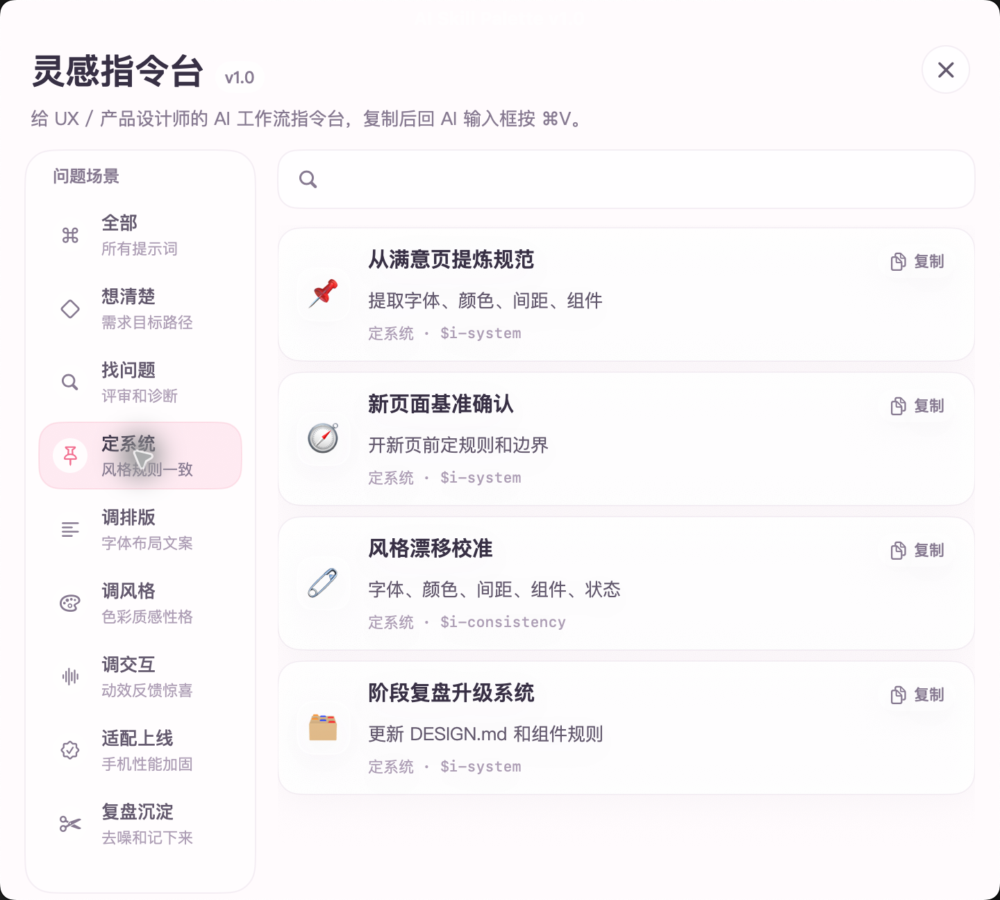

# 灵感指令台 / AI Skill Palette




灵感指令台是一个给 UX / 产品设计师使用的 macOS 全局悬浮 AI 工作流操作台。

它不是单纯的 prompt 收藏夹，而是把产品设计、界面评审、视觉打磨、设计系统沉淀、上线检查和复盘整理这些常见工作，拆成可以一键复制的 AI 工作流指令。

当前版本主要面向 Codex 的本地 skills 体系设计；它本身也可以作为通用 prompt 复制工具，在 Claude Code、Cursor、终端或网页 AI 输入框中粘贴使用。

## 适合谁

- 经常用 AI 做网页、原型、小工具和 vibecoding 的 UX / 产品设计师
- 想让 AI 生成结果更好看、更一致、更像真实产品的人
- 记不住各种 design skills / prompt，但希望随时快速调用的人
- 想把自己的设计判断、复盘和 AI 协作经验沉淀下来的人

## 它解决什么问题

- 不想每次重新写长 prompt
- 不知道当前场景应该用哪个 design skill
- 第一页效果满意，但第二页、第三页开始跑偏
- AI 生成的页面有 AI 味、交互状态缺失、上线前容易漏检查
- 新开 AI 对话时，之前解决过的问题又要重新解释一遍

## 形态

- 菜单栏常驻小图标
- 全局快捷键：`⌘⇧K`
- 悬浮窗口：搜索、按场景筛选、点击复制 prompt
- 不自动粘贴，避免误发；复制后回到 AI 输入框手动 `⌘V`
- 当前产品版本：`v1.0`

## 一键安装

下载仓库后，双击：

```text
install.command
```

它会自动完成两件事：

- 把 `AI Skill Palette.app` 安装到桌面，方便直接打开。
- 把仓库里的 `skills/` 安装到 `~/.codex/skills/`，让 Codex 能识别对应的 `$i-*` skills。

如果已经安装过同名 skills，脚本会先备份到 `~/.codex/skills-backup-ai-skill-palette-*`，再更新为仓库版本。

## 场景分组（v1.0）

- 想清楚：`$i-shape` / `$i-impeccable` / 产品 brief / 一条龙工作流
- 需求综合：`$i-synthesize`
- 找问题：`$i-critique` / `$i-web-interact` / `$i-app-interact`
- 定系统：`$i-system` / `$i-consistency`
- 调排版：`$i-typeset` / `$i-layout` / `$i-clarify`
- 调风格：`$i-colorize` / `$i-bolder` / `$i-quieter` / `$i-polish`
- 调交互：`$i-animate` / `$i-delight` / `$i-overdrive`
- 适配上线：`$i-adapt` / `$i-optimize` / `$i-audit` / `$i-harden` / `$i-handoff`
- 复盘沉淀：`$i-distill` / `$i-recap`

## 附带 Codex Skills

仓库内 `skills/` 目录镜像保存灵感指令台会用到的 `i-*` Codex skills。正式使用位置仍是：

```text
~/.codex/skills/
```

如果换电脑，直接运行 `install.command` 就会自动安装这些 skills。

## 构建

```zsh
cd /Users/fantianxin/Documents/Codex/2026-04-28/http-localhost-8081-blissful-weekend-html/global-skill-palette
./build.sh
```

构建后会生成：

```text
dist/AI Skill Palette.app
```

## 使用

1. 双击 `install.command` 完成安装。
2. 双击桌面的 `AI Skill Palette.app`。
3. 第一次打开如果 macOS 提示安全限制，在 Finder 里右键 App，选择“打开”。
4. 打开后菜单栏会出现一个 `⌘` 小图标。
5. 使用 `⌘⇧K` 唤起/隐藏悬浮面板，也可以点菜单栏 `⌘` 图标。
6. 先选一个问题场景：
   - `想清楚`：需求、目标、用户路径还没有定准。
   - `找问题`：想让 AI 像设计评审一样找问题。
   - `调排版`：字体、布局、文案层级不舒服。
   - `调风格`：整体审美、颜色、质感、强弱需要调整。
   - `调交互`：动效、反馈、愉悦感或高级交互。
   - `适配上线`：移动端、性能、可访问性、真实边界。
   - `复盘沉淀`：删复杂度、去噪、记录 AI 协作和设计思路。
7. 点击条目后 prompt 会复制到剪贴板，面板里会显示“已复制”和下一步提示。
8. 回到 Codex 输入框，按 `⌘V`。如果在 Claude Code / Cursor 中使用，也可以把它当作普通 prompt 粘贴。

## 为什么先做复制，不做自动粘贴

自动粘贴需要模拟键盘输入或控制当前 App，容易误发内容，也可能触发系统辅助功能权限。复制到剪贴板更稳、更安全，适合 MVP。

## 兼容性说明

灵感指令台本身只是一个 macOS 剪贴板工具：点击卡片后把 prompt 复制到剪贴板，因此任何 AI 输入框都可以粘贴使用。

但当前内置 prompt 主要面向 Codex 的本地 skills 体系设计，例如 `$i-shape`、`$i-system`、`$i-recap` 等。要获得完整效果，需要在 Codex 中安装对应 skills。

Claude Code、Cursor 或其他 AI 工具可以把这些 prompt 当作普通自然语言参考使用，但不一定会原生识别 `$i-*` skill 调用。后续如果需要，可以单独做 Claude Code / Cursor 兼容版本。
